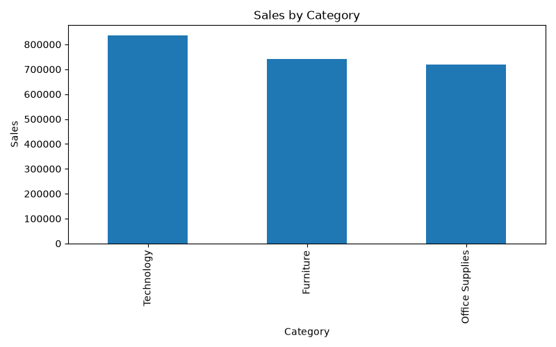
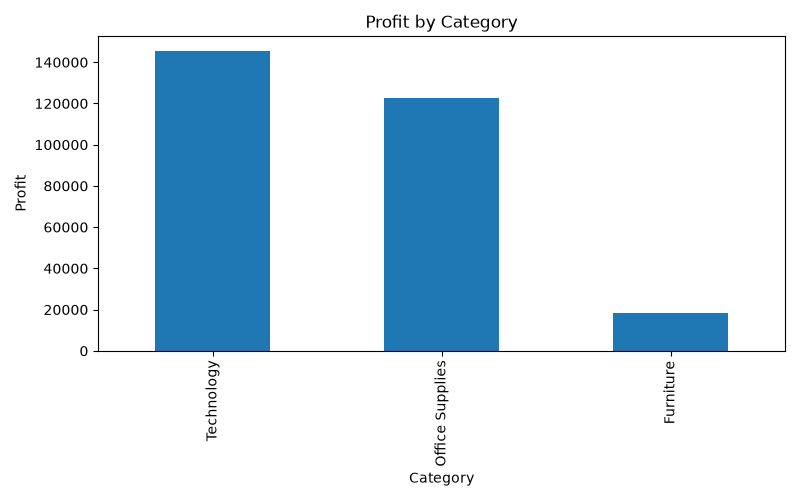
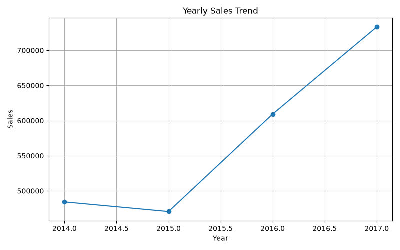
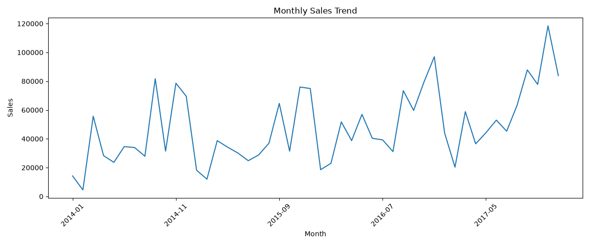
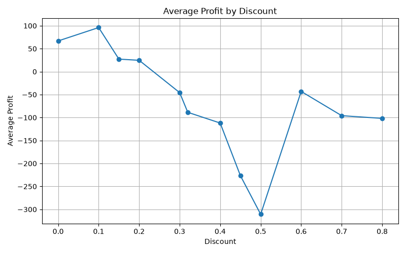
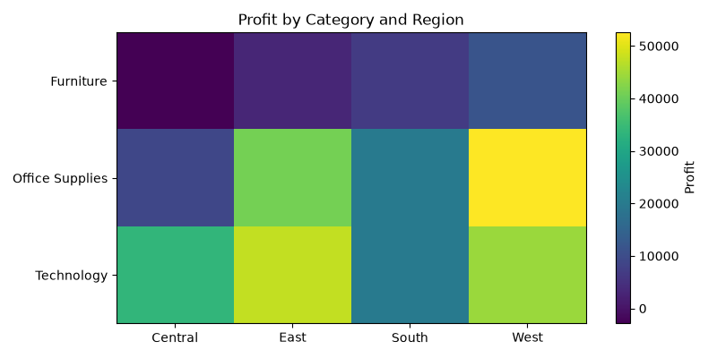

# Pandas — Data Analysis & Business Analytics

Data manipulation, cleaning, and exploratory analysis using Pandas, applied to a real-world retail sales dataset. Includes a full EDA project with business KPI analysis and visualizations.

## Project: Superstore Sales Analysis

End-to-end EDA on the Kaggle Superstore dataset — cleaning, feature engineering, KPI analysis, and visualization.

**Key findings:**
- Technology led all categories in both sales and profit
- Higher discounts showed a strong negative correlation with profit margin
- Sales grew consistently year-over-year with clear monthly seasonality
- Profitability varied significantly by region–category combination (identified via pivot analysis)
- Isolated loss-making sub-categories and products despite positive overall category revenue

**Files:** `05_project_Superstore_Analysis.py` (analysis), `06_project_visualization.py` (visualizations)

### Visualizations

| Sales by Category | Profit by Category |
|---|---|
|  |  |

| Yearly Trend | Monthly Trend |
|---|---|
|  |  |

| Discount vs Profit | Category × Region Heatmap |
|---|---|
|  |  |

## Core Concepts Covered

| Area | Techniques |
|---|---|
| Data Loading | `read_csv`, `read_excel`, Series/DataFrame creation from lists, dicts, NumPy arrays |
| Data Inspection | `head()`, `info()`, `describe()`, `shape`, `dtypes` |
| Data Cleaning | `isnull()`, `dropna()`, `fillna()`, `drop_duplicates()`, `replace()` |
| String Operations | `str.title()`, `str.contains()`, `str.startswith()`, `str.split()`, `str.strip()` |
| Datetime Handling | `to_datetime()`, `.dt` accessor, date filtering, formatting |
| Selection & Filtering | `loc[]`, `iloc[]`, boolean filtering, `isin()`, `between()`, `query()` |
| Feature Engineering | Derived columns (order year/month/day, shipping days, profit status, discount level) |
| Aggregation | `groupby()`, `agg()`, multi-level and custom-named aggregations |
| Merge & Join | `merge()` (inner/left/right/outer), `join()` on index |
| Advanced | `apply()`, lambda functions, pivot tables (`pivot_table`) |

## Technologies

Python · Pandas · NumPy · Matplotlib

## Dataset

[Kaggle — Sample Superstore Dataset](https://www.kaggle.com/datasets/vivek468/superstore-dataset-final): transactional retail data (customer, product, sales, discount, profit, shipping, region).

## Folder Structure

```
03_Pandas/
├── images/
│   ├── 01_sales_by_category.png
│   ├── 02_profit_by_category.png
│   ├── 03_yearly_sales_trend.png
│   ├── 04_monthly_sales_trend.png
│   ├── 05_discount_vs_profit_analysis.png
│   └── 06_category_region_profit_heatmap.png
├── 01_dataframes_series_dataloading.py
├── 02_files.py
├── 03_data_handling.py
├── 04_pivot_table_lambda_apply.py
├── 05_project_Superstore_Analysis.py
├── 06_project_visualization.py
├── Sample_Superstore.csv
└── README.md
```

## Next Module

**SQL** — querying, joins, aggregations, subqueries, window functions.